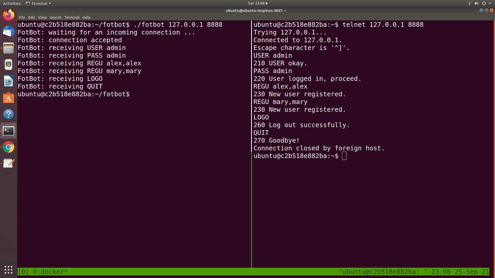
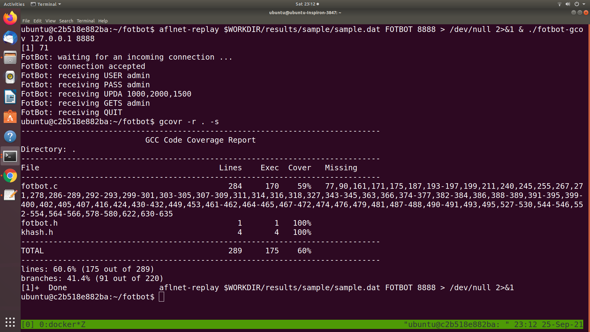

# Fuzzing the FotBot Server

## Overview

This assignment deals with security testing using code coverage-guided fuzzing technique (covered by Chapter 9 in the notes). Since FotBot server is a stateful system (i.e., its behaviour depends not only on the current request message, which is sent from a client, but also on its current state controlled by previous sequence of messages), in this assignment you are recommended to use [AFLNet - A Greybox Fuzzer for Network Protocols](https://github.com/aflnet/aflnet) instead of the [vanilla AFL fuzzer](https://github.com/google/AFL). You are expected to read [AFLNet ICST'20 paper](https://thuanpv.github.io/publications/AFLNet_ICST20.pdf), watch [this presentation video](https://www.youtube.com/watch?v=Au3eO7mEI7E&t=2s), and read [AFLNet README document](https://github.com/aflnet/aflnet/blob/master/README.md) to understand the key concepts of stateful fuzzing for network protocol implementations before starting this assignment.

In this assignment, the FotBot server is implemented in C using the same specification given in the Assignment 1. Some minor modifications have been made and these are clearly explained in "The System: FotBot" section. 

The aim of this assignment is to systematically fuzz test the FotBot server to discover security vulnerabilities. Note that in the context of this assignment, we only consider the following types of faults as security vulnerabilities.

1. Any fault that causes FotBot to crash or hang leading to a denial-of-service attack (e.g., Null pointer dereference ([CWE-476](https://cwe.mitre.org/data/definitions/476.html))).
2. Critical memory faults such as Stack/Heap Buffer Overflow ([CWE-121](https://cwe.mitre.org/data/definitions/121.html) and [CWE-122](https://cwe.mitre.org/data/definitions/122.html)) and Use-After-Free ([CWE-416](https://cwe.mitre.org/data/definitions/416.html)).
3. Logic/functional faults that would allow attackers to gain unauthorized access (e.g., [CWE-285](https://cwe.mitre.org/data/definitions/285.html))
4. Logic/functional faults that would allow attackers to steal users' information or compromise the integrity of users' data.

It means that memory leaks and "benign" integer overflows (i.e., integer overflows that do not lead to more critical issues such as program crashes) are not counted.

## The System: FotBot

As described in Assignment 1, a FotBot looks like a wristwatch and includes functions for counting the steps of the wearer. This data is uploaded into a cloud-based system. In this assignment, we focus on testing the cloud system (i.e., FotBot server). It has four main intended features:

1. To maintain a list of user accounts including an administrator account (username: "admin", password: "admin"). For simplicity, all passwords are not encrypted. Only the admin account should has the capability to add new users to the system.
2. To record the number of steps a person takes each day. Each user can set access permissions to their own data.
3. To share information with other FotBot users for social reasons; e.g.competitions to see who can take the most steps.
4. To share information with the FotBot company.

A description of the functions for FotBot server and its implementation can be found in the file `fotbot/fotbot.c`. The server runs on a specific IP address and listens to connections from FotBot devices (i.e., clients). Once a connection is established, a user can use their FotBot device/client to send requests/commands with arguments/parameters to login to the server, update data, and retrieve their own and their friends' data. Specifically, FotBot server supports 9 commands: USER & PASS (for authentication), REGU (register a new user), UPDA (update step data), GETS (get step data), ADDF (add a friend), GETF (get all friends), LOGO (logout of the current account), and QUIT (terminate a connection). For simplicity, FotBot server does not support concurrent connections and once a connection is terminated, the FotBot server is stopped too. However, in one connection, users can log in and out with different user accounts.

### Building and running the program

The assignment comes with a Dockerfile to ease your setup. To build a "ready-to-fuzz" Docker image, you just need to run the "docker build" command. Specifically, the following command will build a Docker image named "swen90006-assignment2".

```bash
docker build . -t swen90006-assignment2
```

Once the Docker image is successfully built, you can start a Docker container (i.e., a virtual machine). If the container is started properly, you will see a prompt like "ubuntu@c2b518e882ba" where "ubuntu" is the default username and "c2b518e882ba" is the identifier of the running Docker container. You can start multiple containers from the same Docker image if you wish e.g. in case you want to run experiments with different settings. You can view all running Docker containers by running the "docker ps" command.

```bash
docker run -it swen90006-assignment2
```

The source code of the FotBot server is stored inside the `/home/ubuntu/fotbot` folder in the Docker container. To compile it, you just need to run the following commands.

```bash
cd $WORKDIR/fotbot
make all
```

The "make all" command compiles FotBot and produces four different binaries: 1) a normall fotbot server binary (named fotbot), 2) an instrumented binary for fuzzing with AFLNet (named fotbot-fuzz), 3) a binary to collect code coverage using [gcovr](https://gcovr.com/en/stable/guide.html) (named fotbot-gcov), and 4) a binary built with [Address Sanitizer](https://releases.llvm.org/6.0.1/tools/clang/docs/AddressSanitizer.html) (named fotbot-asan) that helps you capture non-crashing errors.

If you make changes to fotbot.c (e.g., adding assertions), you can delete existing binaries and recompile the program by running the following command.

```bash
cd $WORKDIR/fotbot
make clean all
```

The following screenshot shows a sample execution of the normal FotBot server (binary name: fotbot). On the left hand side, you see FotBot server is running on the localhost (IP address: 127.0.0.1) and it is listening to the port 8888. On the right hand side, you see a client---we use [telnet](https://www.acronis.com/en-sg/articles/telnet/) in this exampe---is connecting to and communicating with the server. Once the connection is established, the user can start sending requests/commands to the server. After each successful request, the client would receive a response from the server. For instance, after sending the "USER admin", since the username exists, the client receives "210 USER Okay.\r\n" where 210 is a response code. Note that "\r\n" are CR and LF characters in the [ASCII table](https://www.asciitable.com/)---these are control characters that can be used to mark a line break. All server responses follow the same structure---it starts with a response code, followed by a space character and some descriptive message, and ends with the CR and LF characters.



## Your tasks

In this assignment, you are expected to complete the following tasks.

### Task-1: Prepare a fuzzing setup to fuzz FotBot server

Follow the instructions in AFLNet repository to prepare a fuzzing setup to fuzz FotBot server. Note that the AFLNet source code given in this repository already supports FOTBOT protocol (together with existing protocols like FTP, SMTP etc) so you do not need to make any changes to the files `aflnet/aflnet.h` and `aflnet/aflnet.c`. 

### Task-2: Achieve high code coverage

Run and continuously improve the fuzzing setup to achieve high code coverage. For instance, you might want to improve the quality of the seed corpus or add a fuzzing dictionary. 

To measure how much code coverage your experiments have achieved, given a set of test inputs generated in your experiments, you should run those inputs with the fotbot-gcov binary so that the code coverage information can be collected (see https://gcovr.com/en/stable/guide.html). In the follwing screenshot, we show a sample command to collect the code coverage achieved by a single test input.

```bash
aflnet-replay $WORKDIR/results/sample/sample.dat FOTBOT 8888 > /dev/null 2>&1 & $WORKDIR/fotbot/fotbot-gcov 127.0.0.1 8888
```

The command has two parts: 1) aflnet-replay, which is a utility of AFLNet, plays the role of a client application and 2) the fotbot server runs on localhost at port 8888. aflnet-replay connects to the FotBot server and sends a sequence of requests to the server. While the server is executing and handling the requests, all executed lines and branches/edges in the server source code are recorded in a file named `fotbot.gcda`. In this command, all output from the aflnet-replay utility is discarded because it is redirected to `/dev/null`, which is a special file that is present in every Linux/Unix-based system.

Once the above command completes, you can run `gcovr -r . -s` to get the code coverage information. In this example, it shows a summary of the line coverage and branch coverage:  60.6% of lines and and 41.4% of branches have been covered respectively. Gcovr can also generate a detailed coverage report in HTML format for further analysis. Please read this [gcovr tutorial](https://gcovr.com/en/stable/guide.html) for more instructions.



### Task-3: Discover vulnerabilities

The given FotBot server has at least three (3) known security vulnerabilities. You are expected to discover them and write detailed explanations about what the vulnerabilities are, their impacts and how to reproduce them. 

### Task-4: Write report & reflections

Write a report documenting all your steps from your initial fuzzing setup to improvements you have made to achieve high code coverage & discover more vulnerabilities. 
